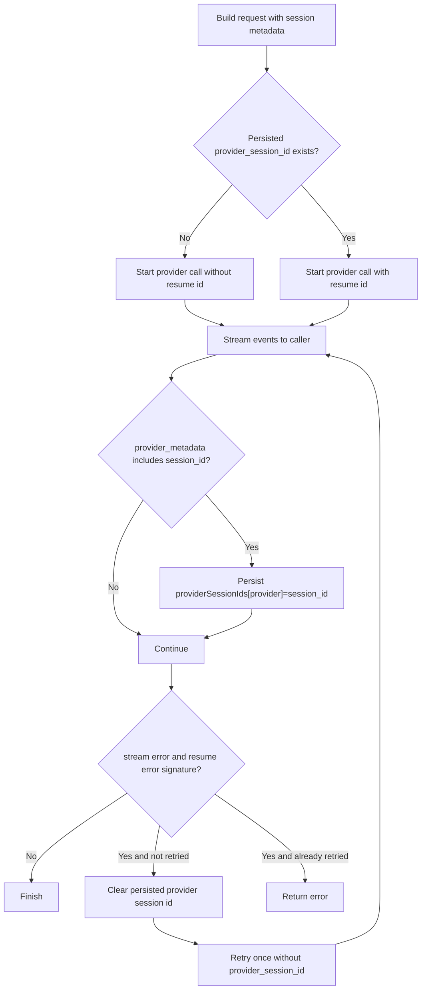

# Session Architecture and Implementation

This document is the implementation source of truth for session behavior in `localclaw`.
It supersedes the former session-continuation design spec.

## 1. Scope

This guide covers:

- session identity and path resolution
- persisted session metadata and transcript layout
- provider-native continuation (Claude Code and Codex)
- runtime retry and failure behavior for stale provider sessions
- reset/new/resume/delete lifecycle behavior
- TUI and MCP session APIs
- configuration and test coverage relevant to sessions

This guide does not define network/server session protocols because `localclaw` remains single-process and local-only.

## 2. Session Identity Model

Canonical session identity is represented by:

- `agentID`
- `sessionID`
- `sessionKey = "<agentID>/<sessionID>"`

Normalization behavior (`internal/runtime/app.go`):

- blank `agentID` resolves to `default`
- blank `sessionID` resolves to `main`
- `ResolveSession(agentID, sessionID)` always returns a stable triple (`AgentID`, `SessionID`, `SessionKey`)

This identity is reused across runtime prompt requests, transcript persistence, MCP session tools, and TUI state.

## 3. Storage Layout and File Resolution

Default storage roots come from config:

- session store file: `~/.localclaw/agents/{agentId}/sessions/sessions.json`
- transcript files: same directory, one `<sessionId>.jsonl` per session

Path resolution is implemented in `internal/session/store.go`.

### 3.1 Session store path resolution

- `StorePath` supports `{agentId}` token substitution.
- `agentId` tokens are sanitized (`/`, `\\`, spaces, `:` converted to `-`).
- relative paths are resolved under configured `StateRoot`.
- `~` expansion is supported.
- resolved paths are cleaned and normalized.

### 3.2 Transcript path resolution

- transcript files are derived from the session directory.
- `sessionID` is sanitized for filename safety.
- final format is `<sanitizedSessionID>.jsonl`.

Example:

- session ID `chat/main` resolves to transcript filename `chat-main.jsonl`.

## 4. Session Metadata Schema

Durable metadata is `session.SessionEntry` (`internal/session/types.go`).

Key fields:

- identity: `id`, `key`, `agentId`
- source and delivery routing: `origin`, `delivery`
- transcript pointer: `transcriptPath`
- compaction/bootstrap/memory markers:
  - `totalTokens`
  - `compactionCount`
  - `bootstrapInjected`
  - `bootstrapCompactionCount`
  - `memoryFlushAt`
  - `memoryFlushCompactionCount`
- provider continuation state:
  - `providerSessionIds: map[string]string`
- timestamps: `createdAt`, `updatedAt`

### 4.1 Provider continuation map

`providerSessionIds` stores provider-native IDs per provider key.

Current provider keys used by runtime/adapters:

- `claudecode`
- `codex`

Helper APIs (`internal/session/provider_sessions.go`):

- `GetProviderSessionID(entry, provider)`
- `SetProviderSessionID(entry, provider, id)`
- `ClearProviderSessionID(entry, provider)`

Normalization behavior:

- provider keys are lowercased and trimmed before map access
- map is allocated lazily on set
- map is set back to `nil` when last provider entry is cleared

## 5. Session Store Design

Session persistence is implemented by `internal/session/store.go`.

### 5.1 Initialization

`Store.Init(ctx)` ensures `sessions.json` exists for:

- the `default` agent
- all known configured agents

When missing, it writes an initialized payload:

```json
{
  "sessions": {}
}
```

### 5.2 Concurrency and locking

All writes use a lockfile-based critical section:

- lock path: `<sessions.json>.lock`
- lock acquisition: `O_CREATE|O_EXCL`
- lock timeout (default): `5s`
- stale lock threshold (default): `15s`
- retry interval (default): `25ms`

Stale lock detection checks:

- lock contents as unix nanos or RFC3339 timestamp, if parseable
- fallback to lock file `ModTime`

### 5.3 Atomic writes

Session store writes are atomic at file level:

1. write JSON to `<sessions.json>.tmp`
2. rename temp file over target (`os.Rename`, with Windows-safe replace path)

File permissions are hardened where supported:

- `sessions.json`: `0600`
- lock file: `0600`

### 5.4 Update invariants

`Store.Update` guarantees:

- non-empty session ID
- stable `id`, `agentId`, `createdAt`
- refreshed `updatedAt`
- auto-resolved `transcriptPath` when path resolution succeeds

`Update` is the primary mutation path used by runtime continuation persistence and token accounting.

## 6. Transcript Persistence and Normalization

Transcript handling is implemented in `internal/session/transcript.go`.

### 6.1 Append behavior

`TranscriptWriter.AppendMessage` appends one JSONL row per message.

Required input:

- non-empty transcript path
- non-empty message content

Row shape:

```json
{
  "type": "message",
  "role": "user|assistant|system",
  "content": "...",
  "createdAt": "RFC3339Nano"
}
```

If role is blank, the `role` field is omitted.

### 6.2 Normalization for memory/search

`NormalizeJSONLTranscript` and `ReadNormalizedTranscript` produce line-oriented normalized text, extracting message text from common JSON transcript shapes (plain string, nested objects, arrays).

This normalization is used by session-memory snapshot and memory indexing helpers.

### 6.3 Transcript event bus

A transcript event bus (`internal/session/events.go`) exists for delta notifications, but runtime currently instantiates `TranscriptWriter` without subscribers by default.

## 7. Runtime Prompt Integration

Session metadata is injected into prompt requests in `internal/runtime/tools.go` via `buildPromptRequest`.

Request session metadata includes:

- `agent_id`
- `session_id`
- `session_key`
- `provider` (active configured provider)
- `provider_session_id` (if persisted for that provider)

Provider session IDs are loaded from `sessions.json` before each prompt attempt.

## 8. Provider Continuation Flow

Core continuation behavior lives in `internal/runtime/llm_runtime.go`.

### 8.1 Stream wrapper behavior

`promptStreamWithSessionContinuation` wraps provider stream events:

- forwards all provider events to callers
- intercepts `provider_metadata` events with non-empty `session_id`
- persists provider session IDs best-effort (errors ignored)

### 8.2 Retry behavior for stale/invalid resumes

If provider stream returns an error and both are true:

- current request used a non-empty `provider_session_id`
- error text matches known stale/invalid resume patterns

Runtime behavior is:

1. clear persisted provider session ID for that provider
2. clear `provider_session_id` in in-flight request
3. retry once with a fresh provider session

Retry is at most once per prompt call.

Recognized error signatures include substrings such as:

- `invalid session`
- `expired session`
- `unknown session`
- `missing session`
- `session not found`
- `no conversation found`
- resume-related variants containing `resume` + `invalid/expired/missing/not found`

## 8.3 Continuation sequence



## 9. Provider Adapter Semantics

### 9.1 Claude Code (`internal/llm/claudecode/client.go`)

### Command construction

Base command:

- `claude -p <input> --output-format stream-json --verbose`

Request path adds:

- MCP config flags (`--mcp-config`, optional `--strict-mcp-config`)
- optional `--allowed-tools` from runtime tool definitions
- configured `extra_args`
- optional `--append-system-prompt` containing system + skill context

### Session args

Controlled by `llm.claude_code.session_mode`:

- `none`: do not add session start/resume args
- `always` (default):
  - if persisted provider session exists: use `resume_args` (default `--resume {sessionId}`)
  - else generate UUIDv4 and pass `session_arg` (default `--session-id`)
- `existing`:
  - resume when persisted provider session exists
  - otherwise no start arg

### Provider session ID discovery

Adapter emits provider metadata with session ID when discovered from configured fields (default includes `session_id`, `sessionId`, `conversation_id`, `conversationId`).

It also emits model/tool metadata from `system/init` events.

### Error behavior nuance

When a `result` error is present, late provider metadata events are suppressed to avoid persisting non-resumable session IDs from failed runs.

### 9.2 Codex (`internal/llm/codex/client.go`)

### Command construction

Base command starts with `codex exec`.

Session behavior:

- resume path when `session_mode != none` and persisted provider session exists:
  - prepends configured `resume_args` (default `resume {sessionId}`)
- non-resume path:
  - includes `-C <workingDirectory>`
  - includes `-p <profile>` when configured

Model behavior:

- uses request model override when present
- otherwise uses configured default model

JSON flag behavior:

- `--json` is always set for non-resume calls
- for resume calls:
  - set `--json` when `resume_output` is `json` or `jsonl`
  - omit `--json` when `resume_output` is `text`

### Provider session ID discovery

Adapter scans configured fields (default `thread_id`, `threadId`, `session_id`, `sessionId`) and emits provider metadata events with `provider=codex` and discovered `session_id`.

`session.configured` events also emit model/tool metadata.

### Stream parsing fallback

If a line is not valid JSON, adapter falls back to emitting it as raw delta text; this keeps text-mode resume output usable.

## 10. Reset/New/Resume/Delete Lifecycle

### 10.1 Runtime reset semantics (`internal/runtime/app.go`)

`ResetSession(req)` always attempts a best-effort session-memory snapshot first.

Snapshot source data:

- current transcript
- session identity
- reset source label (`/reset`, `/new`, etc)

Failure to snapshot is logged and non-fatal.

Then behavior diverges by `StartNew`:

- `StartNew=false`:
  - keep same session ID
  - clear all provider continuation IDs for current session (`providerSessionIds = nil`)
  - clear skill prompt snapshot cache for current session key
- `StartNew=true`:
  - generate next ID `s-YYYYMMDD-HHMMSS[-N]`
  - avoid collisions with:
    - current session ID
    - existing session metadata IDs
    - existing transcript filenames
  - clear skill prompt snapshot cache for old session key

### 10.2 TUI behavior (`internal/tui`)

Slash command session controls:

- `/new`:
  - runs `ResetSession(StartNew=true)`
  - clears visible transcript
  - clears model override
  - shows `started new session <id>`
  - reloads workspace `WELCOME.md` message
- `/reset`:
  - runs `ResetSession(StartNew=false)`
  - clears visible transcript
  - clears model override
  - shows `session reset`
- `/sessions`:
  - lists metadata sorted by `updatedAt` desc
  - marks active session with `(current)`
- `/resume <session_id>`:
  - verifies target session exists
  - aborts active run
  - switches active session identity
  - clears model override
  - loads transcript history rows into chat view
- `/delete <session_id>`:
  - rejects deleting active session
  - deletes target metadata and transcript

### 10.3 MCP orchestration session tools (`internal/mcp/tools/orchestration.go`)

Exposed tools:

- `localclaw_sessions_list`
- `localclaw_sessions_history`
- `localclaw_session_status`
- `localclaw_sessions_delete`

Backend delegates to runtime methods:

- `MCPSessionsList`
- `MCPSessionsHistory`
- `MCPSessionStatus`
- `MCPSessionDelete`

Pagination/defaults at tool layer:

- list: default `limit=20`, capped `100`
- history: default `limit=50`, capped `200`

## 11. Session History Read Semantics

`MCPSessionsHistory` reads transcript JSONL and returns normalized history rows.

Guardrails (`internal/runtime/mcp_support.go`):

- scanner buffer increased to handle large transcript lines
- each returned content string is truncated to `16 KiB`
- invalid JSON rows are skipped
- missing transcript file returns empty history (not error)

Delete semantics (`MCPSessionDelete`):

- removes metadata entry if present
- removes transcript file if present
- returns removed=true if either was removed (handles orphan transcript cleanup)
- clears skill prompt snapshot cache when anything was removed

## 12. Configuration Contract (Session-Relevant)

Session continuation configuration lives under `llm.claude_code` and `llm.codex`.

Shared fields:

- `session_mode`: `always | existing | none`
- `resume_args` (supports `{sessionId}` placeholder)
- `session_id_fields` (fields scanned in provider JSON output)

Claude Code-specific field:

- `session_arg` (start arg, default `--session-id`)

Codex-only field:

- `resume_output`: `json | jsonl | text`

Current defaults (`internal/config/config.go`):

- Claude Code: `session_mode=always`, `session_arg=--session-id`, `resume_args=["--resume","{sessionId}"]`
- Codex: `session_mode=existing`, `resume_args=["resume","{sessionId}"]`, `resume_output=json`

Validation rules include:

- session modes must be one of allowed values
- in `existing` mode, non-empty `resume_args` must include `{sessionId}`
- session ID field lists cannot contain blanks
- codex `resume_output` must be `json|jsonl|text` when set

## 13. Security and Reliability Characteristics

- local-only session persistence (no remote session store)
- lockfile + atomic rename protects `sessions.json` under concurrent writes
- transcript files are append-only JSONL with explicit per-message records
- provider continuation persistence is best-effort and non-blocking for output stream delivery
- stale provider session recovery retries once and then surfaces provider error

## 14. Test Coverage Map (Session-Focused)

Primary tests validating this design:

- session store and helpers:
  - `internal/session/store_test.go`
    - path resolution and sanitization
    - lock timeout/stale lock cleanup
    - concurrent update safety
    - provider session map helper semantics
    - delete semantics
- runtime continuation:
  - `internal/runtime/tools_test.go`
    - request carries session metadata
    - persisted provider session loaded into request
    - provider metadata persistence
    - stale resume clear + retry-once behavior
- reset behavior:
  - `internal/runtime/local_only_test.go`
    - reset snapshot hook behavior
    - `StartNew` ID rotation collision handling
    - same-session reset clears provider continuation IDs
- adapter behavior:
  - `internal/llm/claudecode/client_test.go`
  - `internal/llm/codex/client_test.go`
    - start vs resume arg construction
    - provider session ID extraction
    - resume output mode behavior (codex)
- TUI session UX:
  - `internal/tui/app_test.go`
    - `/new`, `/reset`, `/sessions`, `/resume`, `/delete`

## 15. Known Limitations and Intentional Gaps

Current implementation intentionally keeps these constraints:

- provider resume error detection is substring-based heuristic matching
- provider key normalization currently does not enforce a strict allowlist
- transcript event bus exists but runtime does not yet wire transcript update subscribers at startup
- continuation state is provider-local per session and is not shared across providers
